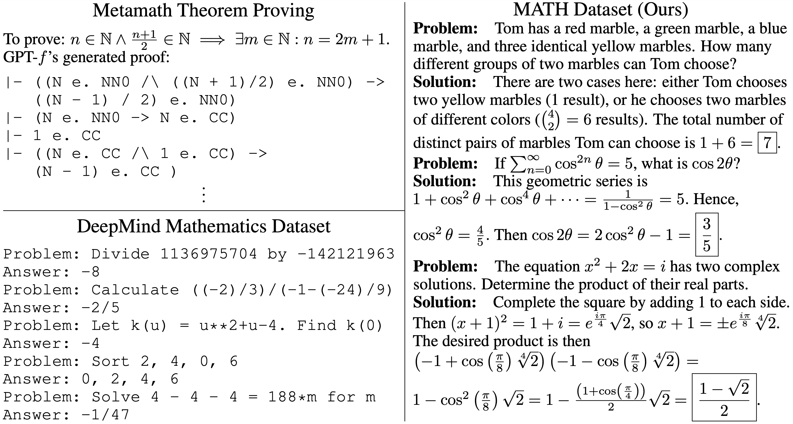

# A*-PO Mathematical Reasoning Pipeline

This repository implements a complete **A*-PO (Advantage-weighted Policy Optimization)** system for training language models on mathematical reasoning tasks, inspired by the PAG (Process-supervised Advantage Generation) paper.

*Original MATH Dataset Repository: [Measuring Mathematical Problem Solving With the MATH Dataset](https://arxiv.org/pdf/2103.03874) by Dan Hendrycks et al.*

## 🎯 Overview

A*-PO is a two-stage reinforcement learning algorithm that combines:
1. **Offline value function estimation** for stable learning
2. **Online policy optimization** with advantage weighting for efficiency
3. **Multi-turn self-correction** for improved solution quality

## 🏗️ Architecture

```
📁 A*-PO Mathematical Reasoning Pipeline
├── 📄 prepare_data.py          # Data loading and preprocessing
├── 📄 apo_algorithm.py         # Core A*-PO implementation
├── 📄 train_math_apo.py        # Training pipeline
├── 📄 evaluate_apo.py          # Evaluation and metrics
├── 📄 demo_apo_pipeline.py     # Complete demonstration
├── 📄 requirements.txt         # Dependencies
└── 📄 README.md               # This file
```

## 🚀 Quick Start

### 1. Install Dependencies
```bash
pip install -r requirements.txt
```

### 2. Run the Complete Demo
```bash
python demo_apo_pipeline.py
```
This will run through the entire pipeline with explanations.

### 3. Prepare Data
```bash
python prepare_data.py
```
Creates:
- `math_prompts_responses.jsonl` - Full MATH dataset
- `math_subset.jsonl` - Subset for experiments  
- `math_eval_500.jsonl` - Evaluation set

### 4. Train the Model
```bash
python train_math_apo.py
```
Implements the two-stage A*-PO training process.

### 5. Evaluate Results
```bash
python evaluate_apo.py
```
Measures accuracy improvements and self-correction benefits.

## 🧠 A*-PO Algorithm Explained

### Stage 1: Value Function Estimation
```python
# Train a value function V(s) to estimate expected returns
for batch in dataloader:
    hidden_states = model(input_ids, output_hidden_states=True)
    returns = estimate_returns(batch)
    values = value_function(hidden_states)
    loss = MSE(values, returns)
    optimize(loss)
```

### Stage 2: Policy Optimization
```python
# Weight policy updates by advantages
for batch in dataloader:
    advantages = returns - value_function(hidden_states)
    policy_loss = language_modeling_loss(outputs, targets)
    weighted_loss = policy_loss * softmax(advantages / temperature)
    optimize(weighted_loss)
```

### Multi-turn Self-Correction
```python
# Generate and iteratively improve solutions
solutions = []
for turn in range(max_turns):
    solution = generate(problem + previous_attempts)
    solutions.append(solution)
    if verify(solution): break
    # Use previous attempt as context for next turn
```

## 📊 Key Features

### 🎯 Core Algorithm
- **Two-stage training** prevents actor-critic instability
- **Advantage weighting** focuses learning on informative examples
- **Value function** provides stable learning signal
- **Multi-turn correction** enables error recovery

### 🔧 Implementation Details
- Integration with **Qwen2.5-1.5B-Instruct** model
- Custom **MathDataset** with efficient batching
- **Mathematical reward estimation** using domain heuristics
- **Comprehensive evaluation** with equivalence checking

### 📈 Evaluation Metrics
- **First vs Final Attempt Accuracy** - measures self-correction
- **Performance by Problem Type** - Algebra, Geometry, etc.
- **Performance by Difficulty Level** - Level 1-5 analysis
- **Multi-turn Improvement Tracking** - correction effectiveness

## 🔬 Expected Results

| Metric | Baseline | A*-PO Expected |
|--------|----------|----------------|
| First Attempt | 15-25% | 15-25% |
| Final Attempt | 15-25% | 20-35% |
| Improvement | 0% | 5-10% |

*Self-correction particularly helps with computational errors*

## 🏃‍♂️ Running Experiments

### Small Scale (for testing)
```bash
# Use subset for quick experiments
python train_math_apo.py --data_file math_subset.jsonl --epochs 2
```

### Full Scale (for research)
```bash
# Use full dataset for complete training
python train_math_apo.py --data_file math_prompts_responses.jsonl --epochs 10
```

### Custom Configuration
```python
from apo_algorithm import A_PO_Config

config = A_PO_Config(
    value_learning_rate=1e-4,
    policy_learning_rate=5e-5,
    max_correction_turns=3,
    advantage_clip=10.0
)
```

## 📋 File Descriptions

### Core Implementation
- **`apo_algorithm.py`** - Complete A*-PO algorithm with value function, advantage computation, and multi-turn correction
- **`train_math_apo.py`** - Training pipeline integrating A*-PO with Qwen2.5-1.5B-Instruct
- **`evaluate_apo.py`** - Comprehensive evaluation with mathematical equivalence checking

### Data and Demo
- **`prepare_data.py`** - MATH dataset loading with inspection and preprocessing
- **`demo_apo_pipeline.py`** - Complete pipeline demonstration with explanations

## 🎓 Educational Value

This implementation serves as a **complete learning resource** for:

### Understanding A*-PO
- Two-stage training methodology
- Value function design principles
- Advantage computation and weighting
- Multi-turn reasoning strategies

### Reinforcement Learning for LLMs
- Actor-critic methods for language models
- Reward estimation in mathematical domains
- Training stability techniques
- Evaluation methodologies

### Mathematical Reasoning
- Problem-solution pair processing
- LaTeX handling and formatting
- Mathematical equivalence checking
- Self-correction mechanisms

## 🔧 Technical Details

### Memory Requirements
- **Training**: ~8GB GPU (with gradient checkpointing)
- **Inference**: ~4GB GPU for generation
- **CPU Mode**: Supported but slower

### Hyperparameter Sensitivity
- **Value learning rate**: 1e-4 to 5e-4 (higher values may cause instability)
- **Policy learning rate**: 1e-5 to 5e-5 (lower than value LR)
- **Advantage clipping**: 5.0 to 20.0 (prevents training instability)
- **Temperature**: 0.1 to 1.0 (controls advantage weighting)

### Common Issues and Solutions
1. **Value function divergence**: Lower learning rate, add regularization
2. **Policy training instability**: Clip gradients, reduce batch size
3. **Memory issues**: Use gradient checkpointing, smaller sequences
4. **Slow convergence**: Increase batch size, adjust learning rates

## 📚 References

- **PAG Paper**: Process-supervised Advantage Generation for mathematical reasoning
- **A*-PO Algorithm**: Advantage-weighted Policy Optimization methodology
- **MATH Dataset**: Competition-level mathematical problem dataset
- **Qwen2.5-1.5B-Instruct**: Base language model for fine-tuning

## 🤝 Contributing

This implementation is designed for educational and research purposes. Key areas for contribution:

1. **Improved Reward Models** - Better mathematical correctness estimation
2. **Advanced Verification** - Integration with symbolic math systems  
3. **Hierarchical Value Functions** - Multi-step problem decomposition
4. **Adaptive Correction** - Dynamic turn count based on problem difficulty

## 📄 License

This project follows the same license as the original MATH dataset and referenced papers. Please cite appropriately if used in research.

---

## 🎉 Congratulations!

You now have a complete A*-PO implementation for mathematical reasoning! This system demonstrates:

- ✅ **Advanced RL techniques** for language model training
- ✅ **Mathematical reasoning** enhancement through self-correction  
- ✅ **Stable training** via two-stage methodology
- ✅ **Comprehensive evaluation** with domain-specific metrics

**Ready to train your mathematical reasoning model with A*-PO!** 🚀

Download the [**MATH dataset here**](https://huggingface.co/datasets/qwedsacf/competition_math).

Download the [**AMPS pretraining dataset here**](https://drive.google.com/file/d/1hQsua3TkpEmcJD_UWQx8dmNdEZPyxw23/view?usp=sharing).



## Citation

If you find this useful in your research, please consider citing

    @article{hendrycksmath2021,
      title={Measuring Mathematical Problem Solving With the MATH Dataset},
      author={Dan Hendrycks and Collin Burns and Saurav Kadavath and Akul Arora and Steven Basart and Eric Tang and Dawn Song and Jacob Steinhardt},
      journal={NeurIPS},
      year={2021}
    }
